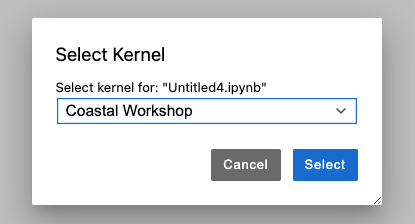

# Coastal EO Applications Workshop

This workshop contains a range of notebooks, broken down into sections.

## Requirements and environment setup

First, log into EASI Asia and open up a terminal.
Then clone this repository: `git clone git@github.com:auspatious/coastal-applications-workshop.git`

Next, download tide model parameters for south east asia.

(Copy and paste the below commands into the terminal and press enter.)

```bash
wget https://files.auspatious.com/coastlines/data/tide_models_vn_ph_2022.zip \
              -O /tmp/tide_models.zip && \
            unzip /tmp/tide_models.zip -d /tmp/tide_models_temp && \
            mv /tmp/tide_models_temp ~/tide_models
```

Finally, set up a custom Python environment  for the workshop.

```bash
MYENV=coastalapps 
python -m venv ~/venvs/$MYENV
realpath /env/lib/python3.10/site-packages > ~/venvs/$MYENV/lib/python3.10/site-packages/base_venv.pth
source ~/venvs/$MYENV/bin/activate
cd coastal-applications-workshop
pip install -r requirements.txt
python -m ipykernel install --user --name=$MYENV --display-name "Coastal Workshop"
```

Now when you run a workshop, you should choose the Kernel as shown below.



## Key links and references

* Element-84's Earth Search STAC Catalog: `https://earth-search.aws.element84.com/v1`
* Microsoft Planetary Computers STAC Catalog: `https://https://planetarycomputer.microsoft.com/api/stac/v1`

## Notebooks

These three notebooks will be a core part of the workshop.

### Getting started with Landsat

[Find, load and visualise Landsat data](notebooks/01_Landsat_GettingStarted.ipynb)

### High- and Low-Tide Composites with Sentinel-2

[High- and low-tide composites](notebooks/02_Sentinel-2_HighLowComposites.ipynb)

### Coastline Extraction with Landsat 

[Step-by-step coastlines algorithm](notebooks/03_Landsat_CoastalChange.ipynb)

### Extra examples

More worked examples that can be run through to learn more about working with
EO data in Python.

* [Getting started with Sentinel-2 data](notebooks/examples/01_Sentinel-2_GettingStarted.ipynb)
* [Intertidal elevation modelling](notebooks/examples/02_IntertidalElevation.ipynb)
from Digital Earth Australia
* [Use Sentinel-1 to detect water](notebooks/examples/03_Sentinel-1_WaterDetection.ipynb)
from Digital Earth Africa
* [Using Sentinel-1 to visualise shipping density](notebooks/examples/04_Sentinel-1_ShippingDensity.ipynb)
* [Machine learning classification using Sentinel-2](notebooks/examples/05_Sentinel-2_MachineLearning.ipynb)
